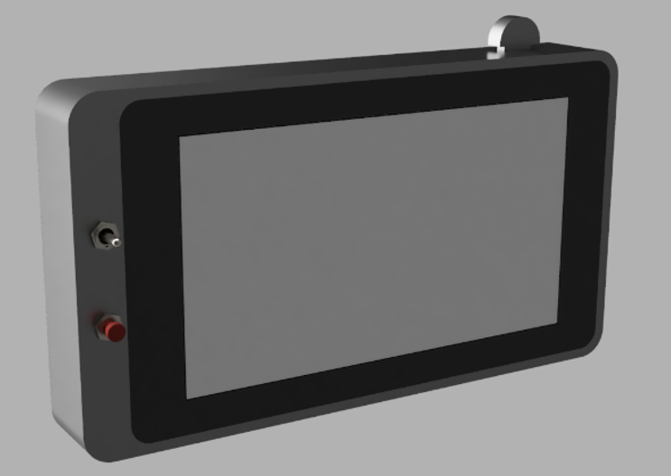

# Cogdeck: Azure AI Services Cyberdeck
The Cogdeck is a [cyberdeck](https://hackaday.com/2022/10/13/2022-cyberdeck-contest-picking-the-best-of-the-best/) showcasing Azure AI services for makers, 
leveraging a straightforward design. The current model features a [Raspberry Pi 4](https://www.raspberrypi.com/products/raspberry-pi-4-model-b/) and a 
[7-inch display](https://www.raspberrypi.com/products/raspberry-pi-touch-display/), and can run on any system that supports .NET 8 or higher, including 
Linux/Raspbian, macOS, and Windows. For additional interactive capabilities, it can be outfitted with a camera module, microphone, and speaker.

This repository includes the application, 3D models for the case, hardware list, and instructions to build and run the Cogdeck.



Read time: __ minutes
Build time: __ minutes

Cost:
- **Hardware**
  - Raspberry Pi 4 ([adafruit](https://www.adafruit.com/product/4295)), $35-$75
  - Pi Foundation 7" display  ([adafruit](https://www.adafruit.com/product/2718])), $80 (*most any display should work*)
  - Momentary button
  - Momentary bi-directional toggle
- **Software**
  - [Azure AI Services](https://azure.microsoft.com/en-us/products/ai-services/) - FREE!
	- Speech-to-text, up to 5 audio hours per month
	- Text-to-speech, up to 500,000 characters per month
	- Translation, up to 2,000,000 characters per month
	- Content Safety, up to 5,000,000 characters per month (in blocks of 1000)
	- Sentiment analysis, up to 5,000,000 characters per month (in blocks of 1000)
	- Summarization, up to 5,000,000 characters per month (in blocks of 1000)
	
# Setup
## Azure
### Azure Account
Create an Azure account, if you don't have one already.
1. In a web browser, navigate to https://azure.microsoft.com/free and click on `Free` or `Pay-as-you-go`.
1. Sign in with your Microsoft or GitHub account.
1. After signing in, you will be prompted to enter some information.
   > Even though this is a free account, Azure may require credit card information. You will not be charged unless you change settings later.

### Azure AI Services
> Azure AI Services was formally called "Azure Cognitive Services", so you still may see that term in some places.

1. Sign into your Azure account at https://portal.azure.com.
1. In the top-left menu, select `Create a resource`.
1. Under `Categories`, select `AI + Machine Learning`.
1. Look for `Azure AI Services` and click on `Create`.
1. Select a subscription. You will likely only have one to choose from.
1. For the resource group, select `Create new` and choose a name (e.g. "rg-cogdeck-001"). Make a note of this name for later.
   > Naming things is hard, see [Azure Naming Conventions](https://learn.microsoft.com/en-us/azure/cloud-adoption-framework/ready/azure-best-practices/resource-naming) for recommendations.
1. Select an appropriate region (e.g. "WestUS2"). See [Products-by-region](https://azure.microsoft.com/en-us/explore/global-infrastructure/products-by-region/?products=cognitive-services) for feature availability.
   > Regions only applies to regional AI services - some services are considered global and regionality will not apply.
1. Choose a name for your resource (e.g. "ai-cogdeck-wus2-001").
   > Naming things is still hard, see [Azure Naming Conventions](https://learn.microsoft.com/en-us/azure/cloud-adoption-framework/ready/azure-best-practices/resource-naming) for recommendations.
1. Select a pricing tier, accept the terms, and click on `Review + Create`.
1. After validation passes, click Create.
1. When deployment has completed (usually in a few seconds), click `Go to resource` to view your Azure AI Services resource.
1. On the left side navigation bar, expand `Resourse Management`, then select `Keys and Endpoint`.
1. Copy either of the two keys, the location/region, and endpoint. Save these values in a secure location for later.

### Azure Content Safety
1. Sign into your Azure account at https://portal.azure.com.
1. In the top-left menu, select `Create a resource`.
1. In the seach box, type in `content safety` and select `Azure AI Content Safety`.
1. On the next screen, find the box labeled `Azure AI Content Safety` and click on `Create`.
1. Select a subscription. You will likely only have one to choose from.
1. For the resource group, select the resource group you created before (e.g. "rg-cogdeck-001").
1. Select an appropriate region (e.g. "WestUS2").
1. Choose a name for your resource (e.g. "ai-cogdeck-wus2-001-safety").
   > Naming things is still hard, see [Azure Naming Conventions](https://learn.microsoft.com/en-us/azure/cloud-adoption-framework/ready/azure-best-practices/resource-naming) for recommendations.
1. Select a pricing tier, accept the terms, and click on `Review + Create`.
1. After validation passes, click Create.
1. When deployment has completed (usually in a few seconds), click `Go to resource` to view your Azure AI Services resource.
1. On the left side navigation bar, expand `Resourse Management`, then select `Keys and Endpoint`.
1. Copy either of the two keys, the location/region, and endpoint. Save these values in a secure location for later.

## Raspberry PI (optional)
The Cogdeck software works on any system supporting dotnet 8+, such as Linux, Raspberry PI OS, macOS, and Windows.
**If** you will be using a Raspberry PI for your Cogdeck, check out [Getting Started with your Raspberry PI](https://www.raspberrypi.com/documentation/computers/getting-started.html) for setup.
We recommend using the [Raspberry PI OS](https://www.raspberrypi.com/software/) as your operating system.

# The Code
## 1. Code Configuration
1. On the Raspberry Pi or your PC, open a command-line terminal.
1. Install .NET 8 SDK.
   - For Raspberry Pi and Linux:
     ```bash
     curl -sSL https://dot.net/v1/dotnet-install.sh | bash /dev/stdin --channel 8.0
     ``` 
     After installation is complete (it may take a few minutes), add dotnet to the command search paths.
     ```bash
     echo 'export DOTNET_ROOT=$HOME/.dotnet' >> ~/.bashrc
     echo 'export PATH=$PATH:$HOME/.dotnet' >> ~/.bashrc
     source ~/.bashrc
     ```
     Verify dotnet was installed successfully by checking the version.
     ```bash
     dotnet --version
     ```
   - For Windows, go to https://aka.ms/maker/dotnet/download, under .NET 8.0 click `Download .NET SDK x64`, and run the installer.
1. Clone the repo.
   ```bash
   git clone https://github.com/adrianwyatt/azure-ai-cyberdeck.git
   ```
1. Update your `configuration.json` with the Azure service endpoints and regions from the [Azure](#azure) sections above.
   - Windows: `notepad ~/azure-ai-cyberdeck/src/cogdeck/configuration.json`
   - Linux: `nano ~/azure-ai-cyberdeck/src/cogdeck/configuration.json`
     (When you are done press `CTRL-O` to save then `CTRL-X` to exit from nano)
   
   The beginning of your `configuration.json` file should look something like this (with your service names and regions):
   ```json
   {
     "AzureAiServices": {
	   "Endpoint": "https://ai-cogdeck-wus2-001.cognitiveservices.azure.com/",
	   "Region": "westus2"
	 },
	 "ContentSafety": {
	   "Endpoint": "https://ai-cogdeck-wus2-001-safety.cognitiveservices.azure.com/",
	   "Region": "westus2"
	 }
   }
   ```
1. Set your Azure service keys as dotnet user-secrets.
   > **Never store your keys in a repository.** If you accidentally expose an Azure service key, invalidate the exposed key by regenerating them on the `Keys and Endpoint` page of your resource.
   1. Open a terminal window and change directory to `src/cogdeck` in the repo (e.g. `cd ~/azure-ai-cyberdeck/src/cogdeck`)
   1. Set the Azure service keys as user-secrets.
      - Windows:
        ```bash
        dotnet user-secrets set "AzureAiServices:Key" "{Your AI Services key}"
        dotnet user-secrets set "ContentSafety:Key" "{Your Content Safety key}"
        ```
      - Linux:
        ```bash
        ~/.dotnet/dotnet user-secrets set "AzureAiServices:Key" "{Your AI Services key}"
        ~/.dotnet/dotnet user-secrets set "ContentSafety:Key" "{Your Content Safety key}"
        ```
1. Build and run the code!
   1. Open a terminal window and change directory to `src/cogdeck` in the repo (e.g. `cd ~/azure-ai-cyberdeck/src/cogdeck`)
   1. Build and run the code.
      ```bash
      dotnet build
      dotnet run
      ```

# Raspberry PI Autostart (optional)
If you are running the Cogdeck on a Raspberry PI, you can configure it to start the Cogdeck application automatically when the system boots.
This setup will start the Cogdeck everytime a bash terminal starts and will set your Raspberry PI to boot directly to a full-screen bash terminal.

## Autostart the Cogdeck when bash starts.
1. Open a terminal windows.
1. Run `sudo nano ~/.bashrc`
1. Scroll to bottom of the file
1. Add `~/.dotnet/dotnet run --project ~/azure-ai-cyberdeck/src/cogdeck` to the end of the file.

## Boot to directly to full-screen terminal
1. Open a terminal window.
1. run `sudo raspi-config`
1. Select `1 System Options`
1. Select `S5 Boot / Auto Login`
1. Select `B2 Console Autologin`
1. Select `Finish` and reboot.

# Using Your Cogdeck
The Cogdeck interface is designed with a dual-panel layout; the left panel offers a suite of Azure AI services, while the right panel serves as a type of workspace.

## Controls
Keyboard: 
- `W` / `S` to select left-side menu items and `ENTER` to run the selected menu item.
- `UP` / `DOWN` arrows to scroll the right-side workspace text.

Cogdeck:
- Use the momentary toggle switch to select left-side menu items
- Use the momentary button to run the selected menu item.

